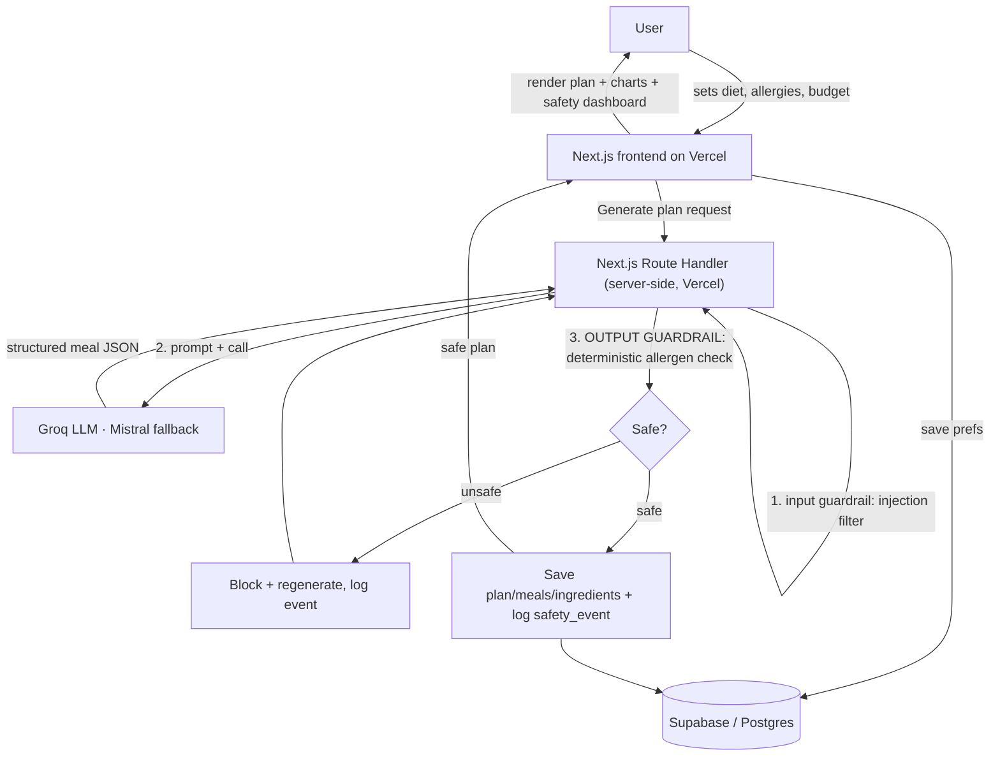

# Aegis — Architecture

> Design-before-generate. The backend is where design gets expensive, so it's decided here *before* a line of code. (Armghan's rule.)

---

## 1. Tech stack (and *why* — this reasoning goes in the README)

| Layer | Choice | Why |
|---|---|---|
| **Frontend** | Next.js (App Router) + TypeScript | Vercel's native framework; the "boring on purpose" pick. Armghan's own class example was Next.js. |
| **Styling** | Tailwind CSS + shadcn/ui | shadcn is what he named for portal/UI design. Fast, tasteful, accessible. |
| **Charts** | Recharts | React-native charting for the budget bar, nutrition donut, safety dashboard. |
| **Database** | Supabase (Postgres) | Data is **relational** (user → plans → meals → ingredients). His rule: relations → Postgres; default to Postgres. |
| **Auth** | Supabase Auth + Row-Level Security | Real per-user access control, not decoration. |
| **AI backend** | Next.js Route Handler (server) — *primary* · FastAPI kept as a stretch | Generation + guardrail run server-side on Vercel (one platform, RLS-enforced — see [Memory.md](Memory.md) D10). A FastAPI version lives in `/backend` as documented architecture, deployed to Render only as a post-core "evidence" stretch — matching CyberGen's FastAPI+LLM stack when time allows. |
| **LLM** | Groq (Llama 3.3 70B) primary · Mistral fallback | Free, fast (speed = "it just works" taste), OpenAI-compatible. Fallback = a small reliability story. |
| **Deploy** | Vercel (frontend + AI route) · Supabase hosted | One platform: the AI call + guardrail run in a Next.js server route on Vercel. Simpler ship, no cold-start, and the route uses the user's session so RLS is enforced. |
| **Version control** | Git + GitHub | Mandated. Small, meaningful commits = visible AI-first process. |
| **API testing** | Postman / Thunder Client / route tests | Named in class notes. |
| **Validation** | Zod (frontend **and** the server route) · Pydantic in the FastAPI stretch | Never trust unvalidated data — especially LLM output. |

### The backend vs. database, in one line each
- **Supabase (database)** = the *pantry* — it only stores data.
- **FastAPI (backend)** = the *kitchen* — it does the work: calls the AI, runs the guardrail, then serves the result.
- **Next.js (frontend)** = the *dining room* — what the user sees and clicks.

---

## 2. App flow



**The critical rule visible in this diagram:** the LLM output never reaches the user without passing the deterministic allergen guardrail. That gate *is* the product.

The generation + guardrail run in a **Next.js server Route Handler on Vercel** (one platform; the route uses the user's Supabase session so RLS is enforced on every write). The same guardrail concept also exists in the `/backend` FastAPI as documented architecture — deployed to Render only as a post-core "evidence" stretch. See [Memory.md](Memory.md) D10.

---

## 3. Data model (Supabase / Postgres)

```
profiles          (1 per user)
  id            uuid  PK → auth.users.id
  display_name  text
  diet_type     text          -- omnivore | vegetarian | vegan | keto | ...
  allergens     text[]         -- ['peanut','shellfish',...] (the user's declared list)
  weekly_budget numeric
  num_people    int
  created_at    timestamptz

meal_plans        (user 1 → many)
  id            uuid  PK
  user_id       uuid  FK → profiles.id
  week_start    date
  total_cost    numeric
  status        text          -- generating | ready | failed
  created_at    timestamptz

meals             (plan 1 → many)
  id            uuid  PK
  plan_id       uuid  FK → meal_plans.id
  day_of_week   int           -- 0..6
  meal_type     text          -- breakfast | lunch | dinner
  name          text
  description   text
  cost          numeric
  calories      int
  protein_g / carbs_g / fat_g  int
  safety_status text          -- passed | blocked_regenerated
  created_at    timestamptz

ingredients       (meal 1 → many)   -- what the guardrail scans
  id            uuid  PK
  meal_id       uuid  FK → meals.id
  name          text
  quantity      text
  allergen_tags text[]         -- ['peanut','dairy',...]

safety_events     (user 1 → many)   -- the audit log → powers the Safety Dashboard + eval
  id            uuid  PK
  user_id       uuid  FK → profiles.id
  plan_id       uuid  FK → meal_plans.id (nullable)
  event_type    text          -- meal_passed | meal_blocked | injection_detected
  allergen      text          -- which allergen triggered it (nullable)
  detail        text
  created_at    timestamptz
```

**Relations (the Postgres justification):** `profiles 1→∞ meal_plans 1→∞ meals 1→∞ ingredients`, plus `profiles 1→∞ safety_events`.

**Row-Level Security:** every table gets a policy `auth.uid() = user_id` (via the plan/meal chain) so a user can only touch their own rows. DDL lives in `/supabase/schema.sql`, policies in `/supabase/policies.sql`.

---

## 4. Folder & file structure

Next.js at the repo root (Vercel zero-config); FastAPI in `/backend` (Render); the Python folder is **not** named `/api` so Vercel doesn't mistake it for serverless functions.

```
Cybergen-internship-task/            ← repo root
├─ CLAUDE.md                         ← master instructions (auto-loaded every session)
├─ Documentary.md                   ← the build journey, CyberGen-framed
├─ README.md                        ← decides-then-builds (created in Phase 6)
├─ playbook/
│  ├─ PRD.md  Architecture.md  Rules.md  Phases.md  Design.md  Memory.md  Prompt.md
│
├─ app/                             ← Next.js App Router (Vercel)
│  ├─ (auth)/login, signup
│  ├─ dashboard/                    ← main app: prefs, plan view, safety dashboard
│  ├─ api/                          ← Next.js server route: AI generation + guardrail (PRIMARY path)
│  ├─ layout.tsx  page.tsx          ← landing
├─ components/
│  ├─ ui/                           ← shadcn components
│  ├─ charts/                       ← BudgetBar, NutritionDonut, SafetyDashboard
│  └─ meal/                         ← MealCard, PlanGrid, SafetyBadge
├─ lib/
│  ├─ supabase/                     ← client + server helpers
│  ├─ guardrails/                   ← allergen.ts (OUTPUT) + injection.ts (INPUT) — deterministic
│  ├─ types.ts                      ← shared TS types (Zod-inferred)
│  └─ validation.ts                 ← Zod schemas
│
├─ backend/                         ← FastAPI (post-core Render stretch; documented architecture)
│  ├─ main.py                       ← app + endpoints
│  ├─ guardrails/
│  │  ├─ allergen.py                ← OUTPUT guardrail (deterministic)
│  │  └─ injection.py               ← INPUT guardrail
│  ├─ llm/
│  │  ├─ groq_client.py             ← primary
│  │  └─ mistral_client.py          ← fallback
│  ├─ eval/
│  │  ├─ run_eval.py                ← the eval harness → prints catch rate
│  │  └─ profiles.json              ← test allergy profiles
│  └─ requirements.txt
│
└─ supabase/
   ├─ schema.sql
   └─ policies.sql
```

### API routes (Next.js Route Handlers, server-side on Vercel)
| Method | Path | Does |
|---|---|---|
| `POST` | `/api/generate-plan` | input guardrail → LLM → deterministic output guardrail → returns safe plan + logs events |
| — | `lib/guardrails/*` | the eval imports the guardrail directly (no network needed) |

*(The `/backend` FastAPI mirrors these — `POST /generate-plan`, `POST /check`, `GET /health` — kept for the post-core Render stretch.)*

---

## 5. Deployment (protecting "shipped")

- **Primary (locked — D10):** everything on **Vercel** — the Next.js frontend plus a **server-side Route Handler** (`app/api/generate-plan`) that runs the LLM call + deterministic guardrail. **Supabase** hosted. Env vars hold all keys. One platform = one clean deploy, no free-tier cold-start, and the route runs under the user's session so **RLS is enforced** on every write.
- **De-risk rule:** Phase 0 deploys the empty Next.js skeleton to a live Vercel URL and confirms it loads **before** building features.
- **Post-core stretch (only after the core ships & is safe):** deploy the `/backend` FastAPI to **Render** as a live "evidence" endpoint (`/health`, `/docs`) — the same guardrail concept in Python — for the CyberGen FastAPI+LLM signal. Optional; never on the critical path. **A working link beats a perfect stack.**

---
*Locked decisions live in [Memory.md](Memory.md). How-we-work rules live in [Rules.md](Rules.md).*
